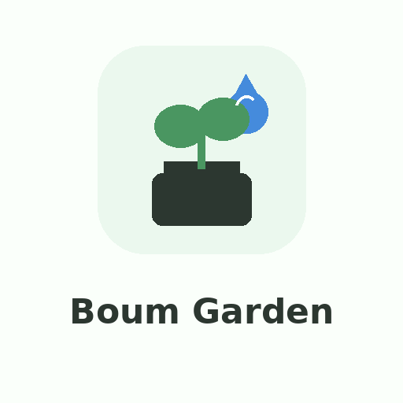

<p align="center">
  
</p>

# Boum Garden

Aktuelle Version: 0.2.4 for Home Assistant

Custom Home Assistant integration for Boum Garden devices using the Boum IoT REST API directly.

This integration is intentionally **not** a wrapper around the Node.js CLI. It talks directly to the same REST endpoints used by `boum-garden/cli`, which is better suited for Home Assistant OS, Docker and HACS installations.

## What it fetches

On every update the integration tries to fetch the data that is documented in the public Boum CLI/API reference:

- current Boum user: `GET /users`
- claimed devices: `GET /devices/claimed`
- full device shadow: `GET /devices/:deviceId`
- device owner: `GET /devices/:deviceId/owner`
- telemetry/default data: `GET /devices/:deviceId/data`
- last-hour telemetry: `GET /devices/:deviceId/data?timeStart=-1h&interval=10s`
- last-7-days telemetry: `GET /devices/:deviceId/data?timeStart=-7d&interval=1h`

Large telemetry series are **not** stored as full entity attributes to avoid bloating the Home Assistant recorder database. Instead, the integration stores compact summaries and exposes the latest values as entities/attributes. The full raw API payload is available in Home Assistant diagnostics.

## Features

### Derived/local values

Boum does not always expose plant names or a direct `last watered` field through the public API.
This integration therefore provides a best-effort derived sensor:

- direct API value first, when fields such as `lastPumped` / `lastWatered` exist
- otherwise the latest telemetry row that indicates active pumping or flow
- otherwise the timestamp recorded locally when the Home Assistant pump switch was turned on

You can also configure a local plant name, location and MDI icon in the integration options.
These values are stored in Home Assistant and are used only when Boum does not expose plant names.


- Config Flow setup from the Home Assistant UI
- Password field is hidden during setup
- Password is not stored after login
- Token refresh support
- Tokens are redacted from diagnostics
- Claimed device discovery
- Device detail/shadow fetching
- Owner fetching
- Telemetry fetching for default/24h, last hour and last 7 days
- Status sensor with compact raw `reported`, `desired`, latest telemetry and API section attributes
- Plant summary sensor that extracts plant objects/names when the API exposes them
- Pump desired/reported/sync sensors so it is visible when a command is pending
- Dynamic sensors for useful scalar values returned by `reported`, `desired` and latest telemetry
- Owner/user/token-like API fields are not exposed as normal entities to avoid nonsense values and privacy leaks
- Common friendly sensors when matching fields are present:
  - battery
  - temperature
  - humidity
  - moisture / soil moisture
  - water level
  - flow rate
  - RSSI
  - last seen
  - last pumped
  - pump state
  - firmware
  - model
  - online / connection status
  - refill schedule and tuning values
  - leakage detection
- Pump switch using `state.desired.pumpState`
- Buttons:
  - refresh
  - restart device
  - reset last pumped
  - reset Wi-Fi credentials, disabled by default because it is disruptive
- Local brand assets for Home Assistant 2026.3+:
  - `custom_components/boum_garden/brand/icon.png`
  - `custom_components/boum_garden/brand/logo.png`
  - dark and 2x variants
- German and English translations


## Tank and water level

Boum confirmed that the app currently calculates water level in the frontend from a distance measurement in centimetres. The integration therefore does not guess tank level from unlabelled telemetry.

Known Boum sizes from public product information:

- Boum Core water tank: 32 L
- Boum Pro water tank: 35 L
- Boum Pro water tank: 55 L
- Boum Core pot: 13 L
- Boum Pro pot: 15 L
- Boum Pro pot: 30 L
- Core/Pro pot internal reservoir: 2 L

For the water level calculation, configure the main tank volume and the measured distances for an empty and full tank in the integration options. The 2 L reservoir belongs to each individual pot and is not the main water tank volume.

Formula:

```text
level_percent = (empty_distance_cm - current_distance_cm) / (empty_distance_cm - full_distance_cm) * 100
level_liters = level_percent * tank_volume_liters / 100
```

Battery is read from explicit API fields such as `batteryCapacity`. Temperature is read only from explicit temperature fields. Ambiguous telemetry X/Y values are not interpreted as battery, water or temperature.

## Installation via HACS custom repository

1. Put this repository on GitHub, for example as `aharder3/boum-garden-homeassistant`.
2. In Home Assistant open **HACS → Integrations → ⋮ → Custom repositories**.
3. Add the repository URL.
4. Category: **Integration**.
5. Install **Boum Garden**.
6. Restart Home Assistant.
7. Go to **Settings → Devices & services → Add integration → Boum Garden**.

## Manual installation

Copy this folder:

```text
custom_components/boum_garden
```

to:

```text
/config/custom_components/boum_garden
```

Then restart Home Assistant and add the integration from the UI.

Example for a Docker setup where Home Assistant config lives under `/docker/homeassistant`:

```bash
scp -r custom_components/boum_garden root@192.168.45.30:/docker/homeassistant/custom_components/
```

Then restart the Home Assistant container.

## Configuration

During setup, enter:

- Boum email
- Boum password
- API environment: `prod`, `dev`, or `local`
- Scan interval in seconds; default is `300`
- Optional custom API base URL

The integration stores the access and refresh token in Home Assistant's config entry storage. The password is used only during setup or reauthentication and is not stored by the integration.

## API behaviour

The Boum API uses these base URLs:

- `prod`: `https://api.boum.us/v1`
- `dev`: `https://api-dev.boum.us/v1`
- `local`: `http://localhost:3000/dev/v1`

The API expects the raw access token in the `Authorization` header, without a `Bearer` prefix. Successful responses are normally wrapped in a `{ "data": ... }` envelope.

The documented `local` environment is a local API development/proxy endpoint. It is **not** automatic LAN discovery of the Boum device IP. If you build or run your own local proxy, enter that proxy URL as custom API base URL.

## Automation examples

Turn the Boum pump on:

```yaml
service: switch.turn_on
target:
  entity_id: switch.boum_xxxxxx_pump
```

Restart a Boum device:

```yaml
service: button.press
target:
  entity_id: button.boum_xxxxxx_restart_device
```

## Notes

The public Boum API documentation does not define every possible reported telemetry field and does not document a separate plant catalogue endpoint. For this reason, the integration creates friendly known sensors where possible and extracts plant objects/names only when they appear in `reported`, `desired`, device detail or telemetry payloads.

The full raw payload is available via Home Assistant diagnostics. If the plant names are not in diagnostics either, the public API currently does not expose them to this integration.

If Boum exposes plant objects such as `plants[0].moisture`, they should appear in the plant summary and as dynamic sensors after a Home Assistant restart/reload. If a new field only appears later, reload the integration so Home Assistant can create the new entity.


## 0.1.9

- Fix Home Assistant 2026 OptionsFlow compatibility.
- Fix sensor platform import error caused by `_normalise_key` initialisation order.
- Broaden pump-state aliases and keep old/invalid timestamps out of entity states.


## Built-in lokale Pflanzen-Zuordnung

Wenn die Boum API keine Pflanzennamen liefert, nutzt die Integration als Fallback Arthurs bekannte Topf-Zuordnung:

- Pflanztopf 01: Zitronenmelisse, Basilikum
- Pflanztopf 02: Minze, Zitronenverbene
- Pflanztopf 03: Oregano, Salbei
- Pflanztopf 04: Rosmarin, Oregano
- Pflanztopf 05: Thymian, Estragon
- Pflanztopf 06: Garten-Petersilie, Koriander
- Pflanztopf 07: Majoran
- Pflanztopf 08: Wald-Erdbeere
- Pflanztopf 09: Garten-Petersilie

Diese Zuordnung kann in den Integrationsoptionen über das JSON-Feld überschrieben werden.


## Plant container mapping

Plant names and plant care metadata are read from the Boum user API. The integration uses `plantContainerId` to group plants into containers. If Boum exposes a human-readable container name, that name is used; otherwise a neutral name such as `Pflanzcontainer 01` is generated from the API order. No Arthur-specific fixed pot mapping is included in the code.

## Dashboard

Ab Version 0.2.4 erstellt die Integration pro Boum-`plantContainerId` eine eigene Topf-Entität. Wenn mehrere Pflanzen im selben Topf sind, erscheinen sie in **einer** Entität und nicht als mehrere Töpfe. Zusätzlich gibt es den Sensor **Pflanztopf Tabelle** mit den Attributen `rows`, `containers` und `markdown_table`.

Ein Beispiel-Dashboard liegt hier:

```text
/dashboard/boum_garden_dashboard.yaml
```

Die dynamischen Karten nutzen `custom:auto-entities` und Mushroom Cards. Die Markdown-Tabelle kann auch ohne Mushroom verwendet werden, sofern du die Entity-ID des Sensors **Pflanztopf Tabelle** einsetzt.

## 0.2.4

- Pro `plantContainerId` wird jetzt genau eine Pflanztopf-Entität erstellt.
- Mehrere Pflanzen pro Topf werden als Pflanzenliste und Detailattribute zusammengeführt.
- Neuer Sensor **Pflanztopf Tabelle** mit `rows`, `containers` und `markdown_table`.
- Aggregierte Topf-Infos: Pflanzenanzahl, Pflanzennamen, Wasserbedarf, Wasserklasse, Lichtbedarf, Erde, Nährstoffe, Temperaturbereich, Bilder und Pflegehinweise.
- Beispiel-Dashboard für Lovelace ergänzt.


## Version 0.2.4

- Added one derived “last watered” timestamp entity per plant container.
- Added “Nächste Bewässerung” derived from `refillTime`, `refillInterval` and `dailyRefill`.
- Suppressed low-value telemetry `x`/`y` dynamic sensors and fixed plain `refillTime` as a readable string sensor.
- Updated the included Sections dashboard snippet to use only Boum Garden entities and show pot-based watering information.

Note: Boum currently exposes pump/refill information at device level in the available API payload. Per-pot last watering is therefore best-effort and based on the device/global pump/refill timestamp unless Boum exposes per-container history in future.


### 0.2.8

- Preserve Boum named telemetry series from `/devices/:id/data`.
- Read `batteryCapacity` from named telemetry as battery percentage.
- Read `temperature` from named telemetry as device temperature.
- Read `waterTableRange` as the measured water distance in cm.
- Support water tank litre calculation from `waterTableRange` plus configured tank settings.
- Add `wifiStrength` as signal strength.
- Do not interpret anonymous `x/y` rows as battery, temperature or tank values.
